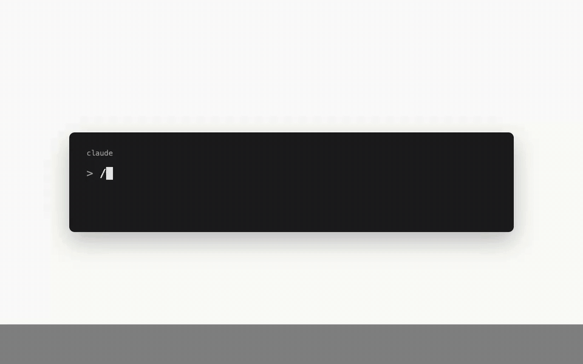
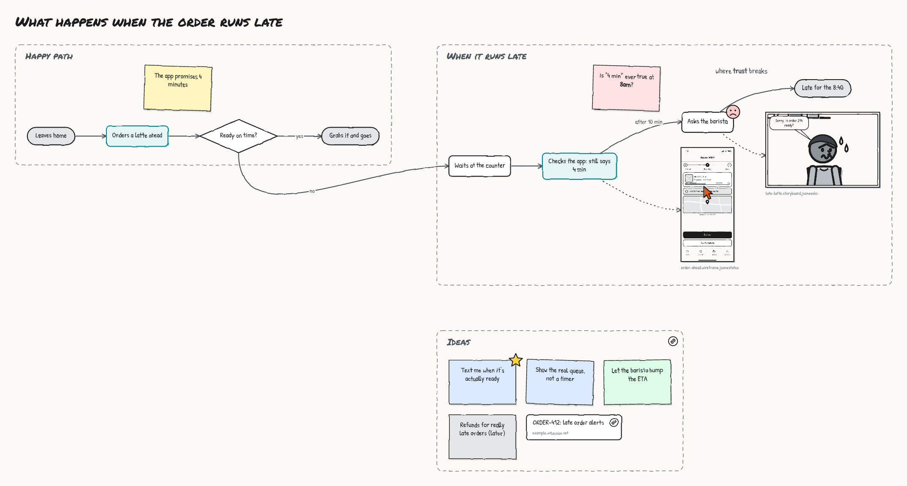
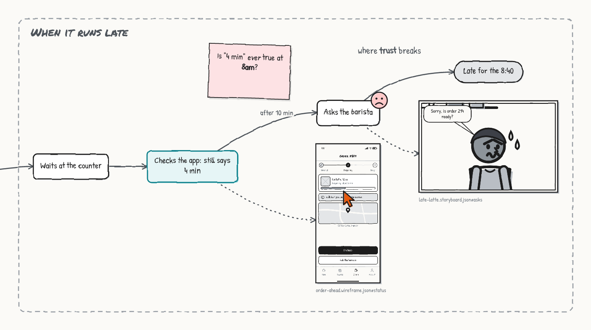
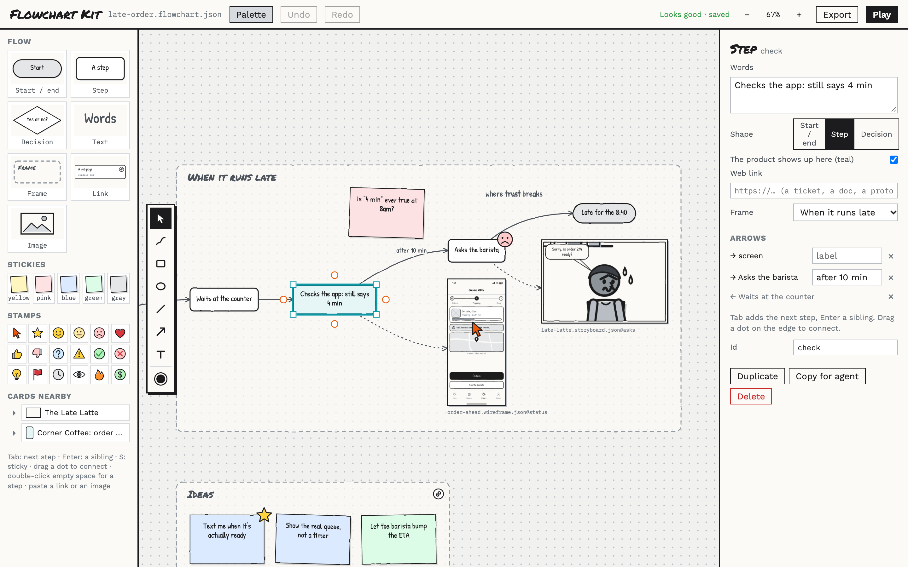
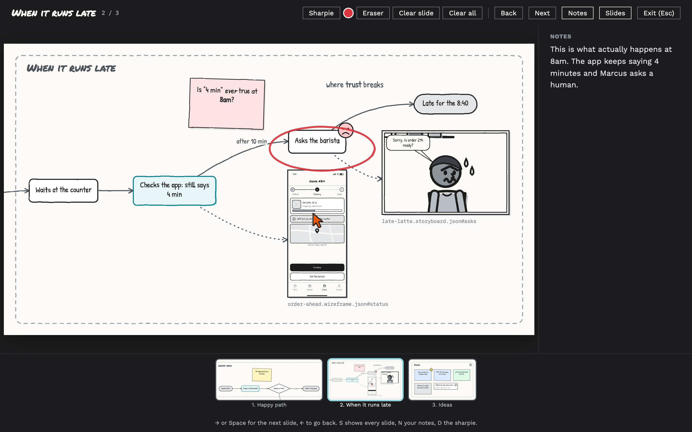

# Flowchart Kit

**Low-fi flowcharts, sticky notes and one big canvas, built by your coding agent.**

You tell Claude Code (or Codex) what you're trying to think through. It maps the flow, sticks notes where the
questions are, pulls in the storyboard panel or wireframe screen that shows the moment, and opens a canvas where
you push things around, add more, and present it. It's for thinking out loud, by yourself, before anything is
real.



## Why though

Most product questions are really "what happens next, and what happens when it goes wrong?" That's a flowchart.
But the useful ones aren't just boxes and arrows. They've got a sticky that says "is 4 minutes ever true at
8am?", a screenshot of the screen people are staring at, and a red circle around the step where trust breaks.

So that's what this is: a marker-and-paper canvas where your agent does the boring part (laying out the boxes,
routing the arrows, finding room for the next frame) and you do the thinking. Everything's drawn by hand, so
nobody mistakes it for a spec.



## Frames are the story

A board is a few **frames**: "Happy path", "When it runs late", "Ideas", "Open questions". Your agent says where
each one goes ("right of the happy path") and the canvas finds the nearest free spot. Flows inside a frame lay
themselves out, so nobody ever writes a coordinate. When you drag something, your drag wins and sticks.

Then hit **Play** and the frames are slides, in your order.

## Plays nice with the other kits

Flowchart Kit works great on its own. It's also the canvas where the other two kits meet:
[Storyboard Kit](https://github.com/jnemargut/storyboard-kit) draws comic strips of someone's day, and
[Wireframe Kit](https://github.com/jnemargut/wireframe-kit) draws low-fi screens and flows. Put either on a board
as a **card**: a whole storyboard, one panel, a whole flow, or one screen.



Cards point at the files (`"ref": "./late-latte.storyboard.json#asks"`), so they're never stale copies. Change
the storyboard and the card catches up on its own. Copy a panel in Storyboard Kit, or a screen in Wireframe Kit,
and paste it onto a board (in Chrome or Edge): it lands as a live card, not a flat picture. Double-click a card to open it in its own
editor. Don't have the other kit installed? The card shows the last picture it drew, marked "out of date" when
the file has moved on.

Branching storyboards fall right out of this: line up panels as cards, link them, and draw the paths people
actually take.

## Install (about 30 seconds)

You need Node.js 18 or newer. That's it. No `npm install`, no build step, nothing native.

```bash
git clone https://github.com/jnemargut/flowchart-kit.git
node flowchart-kit/skills/flowchart/scripts/flowchart.mjs install
```

That drops the skill into `~/.claude/skills/flowchart`. Restart Claude Code and `/flowchart` is ready to go.

- **Codex?** Add `--codex` to the install command.
- **Just one project?** Run `install --project` from inside that project.
- **Old school?** Copy the `skills/flowchart` folder into your agent's skills folder yourself.

## Use it

In Claude Code, type `/flowchart` followed by whatever you're chewing on, in plain words:

```
/flowchart Map what happens when a Corner Coffee order runs late. Use the late latte storyboard and the
status screen, and park a few ideas.
```

Asking for a flowchart, a user flow or a sticky-note board without the slash command usually works too. In
Codex, just ask the same way.

Your agent looks for storyboards and wireframes in the folder, writes `late-order.flowchart.json`, checks it (a
decision with only one way out? an answer nobody labeled?), looks at a render of its own work, and opens the
canvas in your browser. Then keep talking to it:

- *"add a frame for open questions"*
- *"what if the barista could bump the ETA? branch it"*
- *"put the walking panel next to 'Leaves home'"*
- *"make me a deck of this"*

Or just click around yourself. Your edits and the agent's land in the same file, live.

## What's in the box

- **Flow shapes.** Start and end pills, steps, decisions, and arrows with labels ("yes", "no", "after 10 min").
  Mark the steps where the product shows up and they turn teal, like in a storyboard.
- **Stickies** in five colors: yellow for notes, pink for worries, blue for ideas, green for what works, gray for
  parked.
- **Stamps.** A click cursor to drop on a screen, a star for the best idea, a smiley, a frown, thumbs up and
  down, a question mark, a flag and a dozen more. Drop one on anything and it sticks to it.
- **Links.** Paste a URL and it's a link card (a ticket, a doc, a prototype). Any step, sticky or frame can carry
  a link too, and gets a little badge you click to open it.
- **Images.** Drop, paste or upload a photo, a screenshot or a whiteboard shot. It's sketchified in grays to match
  (switch that off if you want the real thing).
- **Text** wherever you want it, with **bold**, *italic* and ~~strikethrough~~ (Cmd+B, Cmd+I).
- **Drawing.** A pen, boxes, ovals, lines, arrows and free text in six marker colors. Draw swimlanes inside a
  frame and they move with it.

## The editor bits



**Flowing**

- **Tab** adds the next step and you're already typing in it. Tab again, and again. **Enter** adds a sibling (another
  way out of the same step). **S** sticks a sticky on whatever's selected.
- Hover a step and drag one of its dots onto another to connect them, or into empty space for a brand-new step.
- Double-click empty space for a step right there. Double-click anything to change its words.

**Moving things around**

- Drag anything. Drag a sticky into another frame and it moves there. Drag a stamp onto a card and it sticks.
- Pull the handles to resize. Select a few things (Shift+click, or Shift+drag a box) and **Put in a new frame**.
- Scroll to pan, pinch (or Cmd+scroll) to zoom, Cmd+0 to fit everything, F to zoom to what's selected.
- Cmd+C / Cmd+V / Cmd+D copy, paste and duplicate. Delete deletes, Cmd+Z undoes.
- **Copy for agent** copies a pointer to whatever you clicked, so you can tell your agent "split this step in two."

**Cards nearby**

The palette lists every storyboard and wireframe in the folder, panel by panel and screen by screen. Click one to
add it next to what's selected, or drag it wherever you like.

## Present it



Hit **Play** (or P). Each frame is a slide, in the order you set in the board's inspector, with a fade or a cut
between them. No frames? You get the whole board.

- → or Space for the next slide, ← to go back. A big pointer the room can follow.
- **D** grabs the sharpie, **E** the eraser. Marks are saved with the board but only show up in Play.
- **N** shows your speaker notes (each frame has its own). **S** shows every slide in a strip.

**Export**

The whole board as PNG or SVG, a PDF with the board plus a page per frame, a slide deck (PowerPoint, Keynote,
Google Slides) with your notes as speaker notes, or JSON Canvas for Obsidian and other canvas apps. Board PNGs
carry their source inside them.

## Under the hood

Everything runs through one bundled script. Agents use it, and so can you:

```bash
fc() { node ~/.claude/skills/flowchart/scripts/flowchart.mjs "$@"; }

fc vocab                         # node types, sticky colors, stamps, frame and link options
fc cards                         # storyboards and wireframes nearby, with their panels and screens
fc validate late-order.flowchart.json
fc dev late-order.flowchart.json
fc render late-order.flowchart.json            # the board as a PNG
fc export late-order.flowchart.json --pdf --pptx --canvas
```

## Hacking on it

```bash
npm install
npm run build      # rebuilds skills/flowchart/
npm test           # unit tests: layout, frames, cards, the checker, exports
npm run e2e        # clicks around the real editor in Chrome
npm run e2e:kits   # copies from Storyboard Kit and Wireframe Kit, pastes onto a board
```

`src/vocab.ts` is the single source of truth for what can go on a board. The schema, the checker, the docs and the
palette all read from it. Layout is [dagre](https://github.com/dagrejs/dagre) inside each frame, plus a little
nearest-free-spot search for the frames themselves. `skills/flowchart/` is generated from `src/` and checked in,
so you can install straight from a clone.

The marker drawing bits (tokens, fonts, the wobble, sketchify, PNG rendering, rich text, the drawing toolbar,
pan and zoom) are shared by all three kits. They live in Storyboard Kit's `src/sketch/`, and `vendor/sketch/` here
is an exact copy. Change them over there, then run `npm run sync-sketch`. The build refuses to run if the copy
was edited by hand, so the kits never quietly drift apart.

## License

MIT. Fonts are Permanent Marker (Apache 2.0) plus Patrick Hand, Work Sans and IBM Plex Mono (SIL OFL).

Go think something through.
