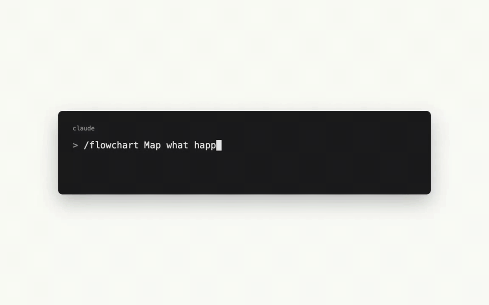
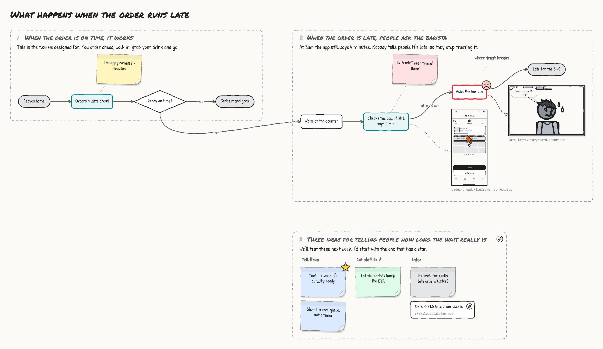
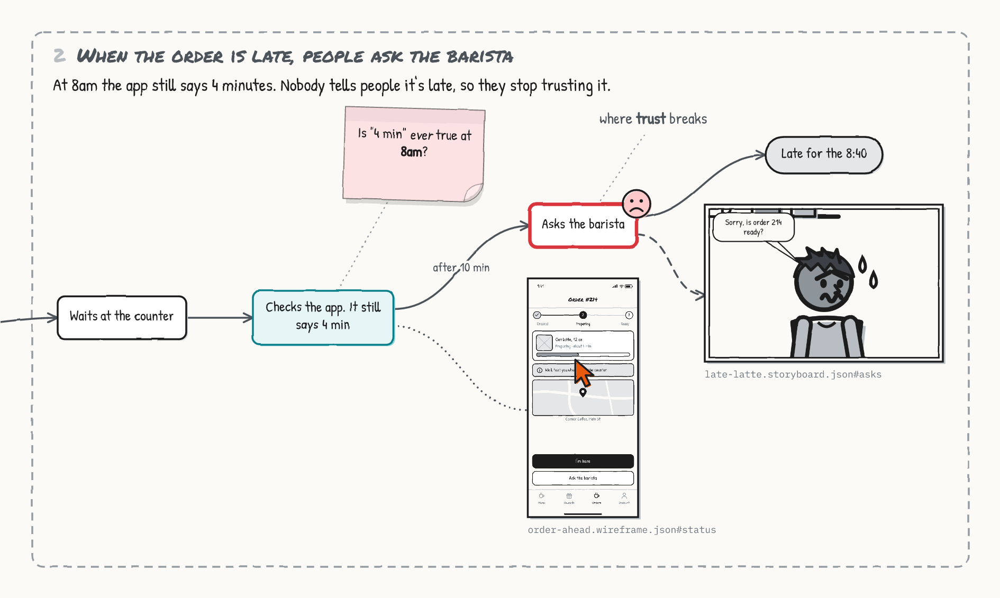
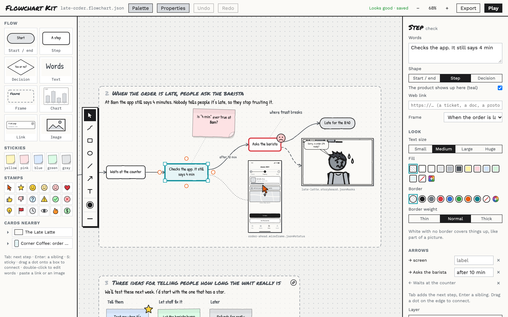
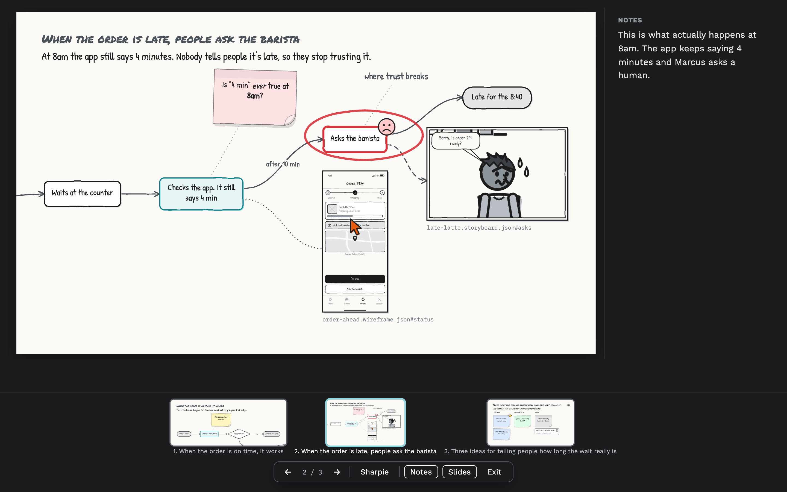

# Flowchart Kit

**Low-fi flowcharts, sticky notes and one big canvas, built by your coding agent.**

You tell Claude Code (or Codex) what you're trying to think through. It maps the flow, sticks notes where the
questions are, pulls in the storyboard panel or wireframe screen that shows the moment, and opens a canvas where
you push things around, add more, and present it. It's for thinking out loud, by yourself, before anything is
real.



## Why though

Most product questions are really "what happens next, and what happens when it goes wrong?" That's a flowchart.
But the useful ones aren't just boxes and arrows. They've got a sticky that says "is 4 minutes ever true at
8am?", a screenshot of the screen people are staring at, and a red circle around the step where trust breaks.

So that's what this is: a marker-and-paper canvas where your agent does the boring part (laying out the boxes,
routing the arrows, finding room for the next frame) and you do the thinking. Everything's drawn by hand, so
nobody mistakes it for a spec.



## Frames are the story

A board is a few **frames**, and each one makes a point. Your agent says where each one goes ("right of the
first one") and the canvas finds the nearest free spot. Flows inside a frame lay themselves out, so nobody ever
writes a coordinate. When you drag something, your drag wins and sticks.

A board should read on its own, so it's built like an argument, not a wall of thoughts:

- **Every frame has a description**, a plain sentence or two under its title, and a title that says something
  ("When the order is late, people ask the barista") instead of naming a topic. The first frame gives the answer.
- **Frames are numbered** in the order you'd read them.
- **Notes read like an outline.** A short heading followed by stickies becomes a column, so what was found, what's
  assumed and what's still open don't end up in one pile.
- **Notes about a step are tied to it** with a dotted line, so nobody has to guess what a sticky is about.

- **Plain words.** Titles, descriptions and notes are written the way you'd say them to a teammate. No clipped
  headlines, no jargon.

`fc critique` checks a board for all of that, and your agent runs it before it hands anything over.

Then hit **Play** and the frames are slides, in your order.

## Plays nice with the other kits

Flowchart Kit works great on its own. It's also the canvas where the other two kits meet:
[Storyboard Kit](https://github.com/jnemargut/storyboard-kit) draws comic strips of someone's day, and
[Wireframe Kit](https://github.com/jnemargut/wireframe-kit) draws low-fi screens and flows. Put either on a board
as a **card**: a whole storyboard, one panel, a whole flow, or one screen.



Cards point at the files (`"ref": "./late-latte.storyboard.json#asks"`), so they're never stale copies. Change
the storyboard and the card catches up on its own. Copy a panel in Storyboard Kit, or a screen in Wireframe Kit,
and paste it onto a board (in Chrome or Edge): it lands as a live card, not a flat picture. Double-click a card to open it in its own
editor. Don't have the other kit installed? The card shows the last picture it drew, marked "out of date" when
the file has moved on.

Branching storyboards fall right out of this: line up panels as cards, link them, and draw the paths people
actually take.

## Install (about 30 seconds)

You need Node.js 18 or newer. That's it. No `npm install`, no build step, nothing native.

```bash
git clone https://github.com/jnemargut/flowchart-kit.git
node flowchart-kit/skills/flowchart/scripts/flowchart.mjs install
```

That drops two skills into `~/.claude/skills`: `/flowchart`, and `/low-fi-think` (more on that below). Restart
Claude Code and they're ready to go.

- **Codex?** Add `--codex` to the install command.
- **Just one project?** Run `install --project` from inside that project.
- **Old school?** Copy the `skills/flowchart` folder into your agent's skills folder yourself.

## Use it

In Claude Code, type `/flowchart` followed by whatever you're chewing on, in plain words:

```
/flowchart Map what happens when a Corner Coffee order runs late. Use the late latte storyboard and the
status screen, and park a few ideas.
```

Asking for a flowchart, a user flow or a sticky-note board without the slash command usually works too. In
Codex, just ask the same way.

Your agent looks for storyboards and wireframes in the folder, writes `late-order.flowchart.json`, checks it (a
decision with only one way out? an answer nobody labeled?), looks at a render of its own work, and opens the
canvas in your browser. Then keep talking to it:

- *"add a frame for open questions"*
- *"what if the barista could bump the ETA? branch it"*
- *"put the walking panel next to 'Leaves home'"*
- *"make me a deck of this"*

Or just click around yourself. Your edits and the agent's land in the same file, live.

## Thinking it through: /low-fi-think

The kits are great when you know what you want: a storyboard, some screens, a board. Most days, though, it starts
with someone else's ask. "The PM wants me to do PAY-218. I need to rethink it. Here are the two Jiras."

That's what `/low-fi-think` is for. It ships with Flowchart Kit and uses all three kits:

1. **It reads the ask.** Tickets, linked tickets, docs, threads, whatever your agent can open with the tools you've
   given it (a Jira MCP, `gh`, a docs connector). What's being asked, why, for whom, and what's missing.
2. **It works out what kind of thinking it needs.** Is the real question what people do today (a storyboard), what
   the screens are (wireframes), where the paths branch and break (a flow), or which of a few directions (options
   side by side)? Usually it's two or three of those.
3. **It says the plan in a breath and gets going.** No twenty questions. What it can't answer becomes a pink sticky.
4. **It builds them in order, wired together.** The storyboard of today, the screens the ask implies, and one board
   that holds it all: *The ask* (the tickets as link cards), *What actually happens*, *The ask as a flow* (with where
   it breaks circled in red), *Options*, and *Questions for the PM*. Frames in story order, so it's already a deck.
5. **It hands it over.** The board open in your browser, what it thinks in a few sentences, the questions it would
   take back, and what it assumed.

```
/low-fi-think The PM wants me to do PAY-218, I need to rethink it. They linked PAY-218 and PAY-221.
```

It picks a recipe by the question you're asking, not by what's newest:

| The question | What it makes |
|---|---|
| The PM wants X, but is X the right thing? | The ask vs. what really happens, options, questions to take back |
| Notes everywhere, no shape yet | Stickies grouped into what they mean, plus open questions |
| Which of these directions? | A frame per direction, then side by side |
| Where does this flow break? | The happy path, a frame per unhappy path, screens at the branches |
| How do I explain this decision? | Before, after, what we're not doing, what we need: a deck |
| Where do we even start? | A one-frame brief: problem, who, decided, unknowns, how we'd know |
| What did the research say? | Findings in people's own words, and a storyboard built from their quotes |
| What do the numbers say? | Two or three rough charts, each with its takeaway and its caveat beside it |
| How do others do it? | Their screens in a row per product, with what to steal and avoid |
| What has to happen behind the scenes? | A service blueprint: the person, the product, staff and systems in lanes |
| What screens are there? | A site map, top down, with orphans and dead ends flagged |
| What's the smallest version? | Now, next and later, with the small and full versions wireframed side by side |
| What could make this fail? | Assumptions ranked by risk, with a cheap test for the top three |
| Will people get it? | A clickable prototype you can send, tasks in the person's words, and what to watch for |
| Why change anything? | Today's storyboard beside the proposed one, panel for panel |
| What should it look like? | A moodboard: your references in full color, mood words, palettes and type, two or three directions |

Don't have Storyboard Kit or Wireframe Kit? It works around them and tells you what it's missing. `fc kits` shows
what's installed.

## What's in the box

- **Flow shapes.** Start and end pills, steps, decisions, and arrows with labels ("yes", "no", "after 10 min").
  Mark the steps where the product shows up and they turn teal, like in a storyboard.
- **Any color, when color is the point.** Every color row ends in a **+**: the system color picker, a hex field,
  and a dropper that grabs a color from anywhere on your screen (Chrome and Edge). Colors you've used come back as
  one-click dots. Handy for palettes on a moodboard; everything else stays in calm marker grays.
- **Stickies** in five colors, with a peeled-up corner so they look stuck on: yellow for notes, pink for worries,
  blue for ideas, green for what works, gray for parked.
- **Looks, when you want them.** Text from small to huge, fills (including plain white for covering something up),
  border colors and weights. Arrows can be curved, angled or straight, solid, dashed or dotted, in any color,
  with an arrowhead at either end, both, or neither, and labels in four sizes. Arrow cutting through something? Select it and drag the
  round handle in its middle to route it around; double-click the handle to straighten it again.
- **Stamps.** A click cursor to drop on a screen, a star for the best idea, a smiley, a frown, thumbs up and
  down, a question mark, a flag and a dozen more. Drop one on anything and it sticks to it.
- **Links.** Paste a URL and it's a link card (a ticket, a doc, a prototype). Any step, sticky or frame can carry
  a link too, and gets a little badge you click to open it.
- **Images.** Drop, paste or upload a photo, a screenshot or a whiteboard shot, or drag the Image tile out for an
  empty one to fill in. It's sketchified in grays to match (switch that off if you want the real thing), and
  **Crop…** shows just the part you want, **Mirror** flips it and **Turn** gives it a quarter turn. Cards from
  the other kits crop too.
- **Rough charts.** Bars, sideways bars, a line, a funnel, a pie or a donut from a few numbers, drawn in marker
  with every number written on it. Call out the one that matters and the rest stay gray. Type the numbers in the
  side panel, or copy cells from a spreadsheet and paste them on the board: they land as a chart. Made for "most
  people drop off at the cart", not for dashboards.
- **Text** wherever you want it, with **bold**, *italic*, underline and ~~strikethrough~~ (Cmd+B, Cmd+I, Cmd+U).
- **Drawing.** A pen, boxes, ovals, lines, arrows and free text in six marker colors (or any color you pick), thin,
  normal or thick, and text in four sizes. Draw swimlanes inside a
  frame and they move with it. Shortcuts: V, D, R, O, L, A, T (the same in every kit).

## The editor bits



**Flowing**

- **Tab** adds the next step and you're already typing in it. Tab again, and again. **Enter** adds a sibling (another
  way out of the same step). **S** sticks a sticky on whatever's selected.
- Hover a step and drag one of its dots onto another box to connect them. The box lights up with its own dots: drop
  on one to pick that side, or anywhere on the box and it picks for you. Drag into empty space for a brand-new step.
- Double-click anything to change its words.

**Moving things around**

- Drag anything. Drag a sticky into another frame and it moves there. Drag a stamp onto a card and it sticks.
- Things stay where you put them. Once you've touched a board, small changes (flipping an arrow, a new link) never
  reshuffle it, and new steps land next to what they're linked to. **Tidy up** lays a frame, or the whole board,
  out automatically again.
- Pull the handles to resize. Select a few things (Shift+click, or Shift+drag a box) and **Put in a new frame**.
- Scroll to pan, pinch (or Cmd+scroll) to zoom, Cmd+0 to fit everything, F to zoom to what's selected.
- Cmd+C / Cmd+X / Cmd+V / Cmd+D copy, cut, paste and duplicate. Copying puts a picture of what you copied on the
  clipboard too, so it pastes straight into Slack or a doc, and pastes back onto a board as the real thing.
- Cmd+] / Cmd+[ bring things forward or back (add Shift for all the way). Delete deletes, Cmd+Z undoes.

**Lining things up**

- Drag something near another box and guides pop up when edges or middles line up, and it snaps. Hold Option to
  drag freely.
- Select a few things and the side panel lines them up (left, center, right, top, middle, bottom) or spaces them
  out evenly.
- **Group** (Cmd+G) ties things together so clicking one picks them all up. Shift+Cmd+G ungroups.
- **Lock** (Shift+Cmd+L) keeps something put while you work around it. Same keys unlock it.
- **Copy style** (Option+Cmd+C) and **Paste style** (Option+Cmd+V) move colors, lines and text size from one thing
  to another.
- **Copy for agent** copies a pointer to whatever you clicked, so you can tell your agent "split this step in two."

**Cards nearby**

The palette lists every storyboard and wireframe in the folder, panel by panel and screen by screen. Click one to
add it next to what's selected, or drag it wherever you like.

## Present it



Hit **Play** (or P). Each frame is a slide, in the order you set in the board's inspector, with a fade or a cut
between them. No frames? You get the whole board. The slide is all that's on screen: the controls are a small
bar that shows up when you move the mouse and steps aside when you stop.

- → or Space for the next slide, ← to go back. A big pointer the room can follow.
- **D** grabs the sharpie, **E** the eraser. Marks are saved with the board but only show up in Play.
- **N** shows your speaker notes (each frame has its own). **S** shows every slide in a strip.

**Export**

The whole board as PNG or SVG, a PDF with the board plus a page per frame, a slide deck (PowerPoint, Keynote,
Google Slides) with your notes as speaker notes, or JSON Canvas for Obsidian and other canvas apps. Board PNGs
carry their source inside them.

## Under the hood

Everything runs through one bundled script. Agents use it, and so can you:

```bash
fc() { node ~/.claude/skills/flowchart/scripts/flowchart.mjs "$@"; }

fc vocab                         # node types, sticky colors, stamps, frame and link options
fc cards                         # storyboards and wireframes nearby, with their panels and screens
fc validate late-order.flowchart.json
fc critique late-order.flowchart.json          # does it read on its own?
fc dev late-order.flowchart.json
fc render late-order.flowchart.json            # the board as a PNG
fc export late-order.flowchart.json --pdf --pptx --canvas
```

## Hacking on it

```bash
npm install
npm run build      # rebuilds skills/flowchart/
npm test           # unit tests: layout, frames, cards, the checker, exports
npm run e2e        # clicks around the real editor in Chrome
npm run e2e:kits   # copies from Storyboard Kit and Wireframe Kit, pastes onto a board
```

`src/think.ts` is `/low-fi-think`'s instructions (it's all words: no code of its own). `src/vocab.ts` is the single
source of truth for what can go on a board. The schema, the checker, the docs and the
palette all read from it. Layout is [dagre](https://github.com/dagrejs/dagre) inside each frame, plus a little
nearest-free-spot search for the frames themselves. `skills/flowchart/` and `skills/low-fi-think/` are generated
from `src/` and checked in, so you can install straight from a clone.

The marker drawing bits (tokens, fonts, the wobble, sketchify, PNG rendering, rich text, the drawing toolbar,
pan and zoom) are shared by all three kits. They live in Storyboard Kit's `src/sketch/`, and `vendor/sketch/` here
is an exact copy. Change them over there, then run `npm run sync-sketch`. The build refuses to run if the copy
was edited by hand, so the kits never quietly drift apart.

## License

MIT. Fonts are Permanent Marker (Apache 2.0) plus Patrick Hand, Work Sans and IBM Plex Mono (SIL OFL).

Go think something through.
